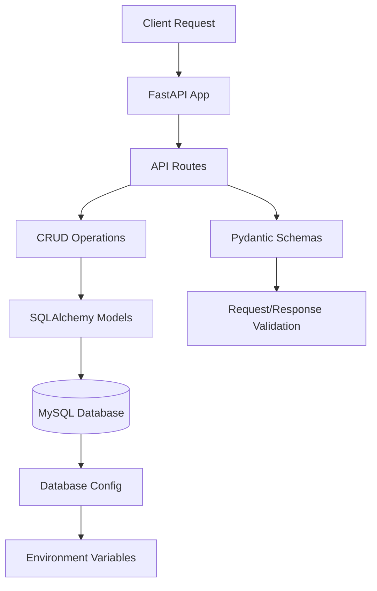

# Complete Patient Microservice API Project

## Project Overview

This is a **Patient Service Microservice** built with FastAPI that manages patient profiles. It provides CRUD operations for patient data including personal information, emergency contacts, and insurance details.

### Current State Analysis

**What's Working:**

- Basic FastAPI application structure
- CRUD endpoints implemented (Create, Read, Update, Delete, List)
- Database connection setup with SQLAlchemy
- Pydantic schemas for request/response validation
- MySQL database configuration

**Issues Identified:**

1. **Duplicate Models**: Two Patient model files (`app/models.py` and `app/models/models.py`) with conflicting schemas
2. **Syntax Error**: Trailing comma in `app/models/models.py` line 15 (`age = Column(Integer, nullable=False),`)
3. **Schema Mismatch**: Pydantic schemas don't include all model fields (missing `insurance_company_phone`, `status`, `age`, `created_at`, `updated_at`)
4. **Empty Requirements**: `requirements.txt` is empty - dependencies need to be documented
5. **Poor Architecture**: All CRUD logic is in `main.py` instead of separate modules (empty `api/` and `crud/` directories suggest planned refactoring)
6. **Hardcoded Configuration**: Database credentials hardcoded in `database.py`
7. **Incomplete Documentation**: README only has a title
8. **Database Schema Mismatch**: SQL file doesn't match current model fields

## Implementation Plan

### Phase 1: Fix Core Issues

1. **Consolidate Models** ([app/models.py](app/models.py) vs [app/models/models.py](app/models/models.py))

   - Remove duplicate model file
   - Keep the more complete model from `app/models.py` (has `insurance_company_phone`, `patient_status`, `status`)
   - Fix syntax errors
   - Ensure model matches database requirements

2. **Update Schemas** ([app/schemas/Schema.py](app/schemas/Schema.py))

   - Add missing fields to match the consolidated model
   - Include `insurance_company_phone`, `status`, `created_at`, `updated_at` in response schema
   - Make `patient_status` optional if needed
   - Add proper validation (e.g., phone number format, date validation)

3. **Create Requirements File** ([requirements.txt](requirements.txt))

   - Add FastAPI and dependencies
   - Add SQLAlchemy and MySQL driver (pymysql)
   - Add Pydantic for validation
   - Add uvicorn for running the server
   - Add python-dotenv for environment variables

### Phase 2: Improve Architecture

4. **Refactor to Proper Structure**

   - Move CRUD operations from [app/main.py](app/main.py) to [app/crud/patient.py](app/crud/patient.py)
   - Create API route handlers in [app/api/patient_routes.py](app/api/patient_routes.py)
   - Update `main.py` to import and register routes
   - Add proper error handling and logging

5. **Configuration Management** ([app/database.py](app/database.py))

   - Create `.env.example` file with database configuration template
   - Use `python-dotenv` to load environment variables
   - Move database URL to environment variables
   - Add configuration validation

### Phase 3: Enhance Features

6. **Update Database Schema** ([app/patient_db.sql](app/patient_db.sql))

   - Align SQL schema with the consolidated model
   - Add missing columns: `insurance_company_phone`, `patient_status`, `status`
   - Ensure ENUM values match model definitions

7. **Add Validation & Error Handling**

   - Add input validation for phone numbers, dates
   - Improve error messages
   - Add request logging
   - Handle database connection errors gracefully

8. **Documentation** ([README.md](README.md))

   - Add project description
   - Document API endpoints
   - Add setup instructions
   - Include environment variable documentation
   - Add example requests/responses

### Phase 4: Quality & Best Practices

9. **Add Missing Features**

   - Calculate `age` automatically from `date_of_birth` (remove from model if it's computed)
   - Add pagination metadata to list endpoint
   - Add filtering/search capabilities to list endpoint
   - Add health check endpoint

10. **Code Quality**

    - Add type hints throughout
    - Add docstrings to functions
    - Ensure consistent code style
    - Fix import statements (use relative imports where appropriate)

## Architecture Flow



## File Structure (After Completion)

```
microservice-api-ria/
├── app/
│   ├── __init__.py
│   ├── main.py                 # FastAPI app initialization
│   ├── database.py             # Database configuration
│   ├── models.py               # SQLAlchemy models (consolidated)
│   ├── api/
│   │   ├── __init__.py
│   │   └── patient_routes.py   # API route handlers
│   ├── crud/
│   │   ├── __init__.py
│   │   └── patient.py          # CRUD operations
│   └── schemas/
│       ├── __init__.py
│       └── Schema.py           # Pydantic schemas
├── .env.example                # Environment variables template
├── .env                        # Actual environment variables (gitignored)
├── requirements.txt            # Python dependencies
├── README.md                   # Project documentation
└── app/patient_db.sql          # Database schema
```

## Key Decisions

1. **Model Consolidation**: Use `app/models.py` as the source of truth (more complete)
2. **Age Field**: Calculate dynamically from `date_of_birth` rather than storing
3. **Architecture**: Follow FastAPI best practices with separate routes and CRUD layers
4. **Configuration**: Use environment variables for all sensitive/configurable data
5. **Validation**: Leverage Pydantic for comprehensive input validation

## Success Criteria

- ✅ Single, consistent Patient model
- ✅ Complete Pydantic schemas matching the model
- ✅ All CRUD operations working correctly
- ✅ Proper project structure with separated concerns
- ✅ Environment-based configuration
- ✅ Complete documentation
- ✅ All dependencies documented
- ✅ Database schema aligned with models